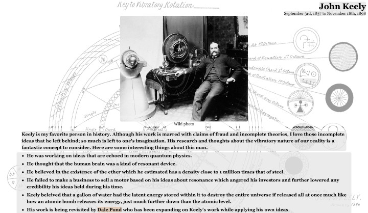

# [Tribute Page](https://wmcooper2.com/tribute-page)
A simple tribute page to my favorite, although fradulent, historical figure.

## Purpose/Goal
This was my first web project, so it was my introduction to HTML and CSS. I learned basic tags and simple stylings.

## Operation
N/A

## Tech/Libraries Used
* HTML
* CSS

## Problems/Solutions
N/A

## More Information
Although it doesn't have any JavaScript, I keep it under the JavaScript section of my web portfolio.
